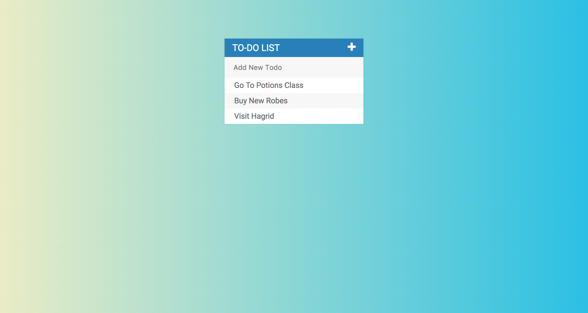

# TodoList

TodoList is a simple to-do list web project made using HTML, CSS, Font Awesome, JavaScript, and jQuery. I built it as part of a code-along in Colt Steele's Web Development [course](https://www.udemy.com/the-web-developer-bootcamp/) on Udemy.

You can view a live version of the web project [here](https://do-adams.github.io/TodoList/), courtesy of GitHub Pages.
